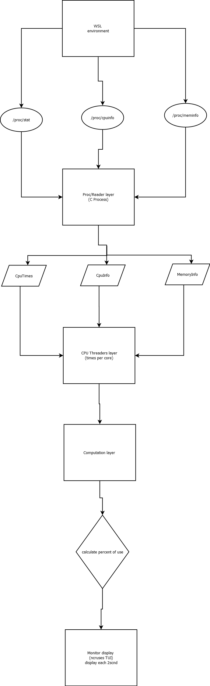

# 1st Assignment — Embedded Linux Resource Monitor


### Course: _Linux Services & Embedded Systems_

**Instructor:** Juan Bernardo Gómez Mendoza  
**Environment:** WSL / Ubuntu / Linux Kernel Interface (`/proc`)

---

## class-room description :

Write a C project that reads the information at /proc/stat, /proc/cpuinfo and /proc/meminfo periodically (every two seconds), and show in the screen:

- How much installed memory the system has.
- How much physical and virtual memory is being used.
- What kind of processor the system has.
- How many cores are present in the system.
- The system processor load per core.
  The project should be version-controlled using git, either locally or in the cloud (Github, Gitlab, ...).

TIP: You can use a text-user-interface (TUI) library to present the information on screen.

---

## system Architecture — Embedded Linux Resource Monitor

El siguiente diagrama resume el flujo de datos y procesamiento del sistema embebido:



> **Figura:** Flujo de datos desde el entorno WSL/Linux `/proc/` hacia la interfaz TUI.
> Implementado en C utilizando `ncurses` para visualización en tiempo real.

---

## structure dir

```
EmbeddedOnLinuxLR/
└── devEnv/
    ├── work/
    │   └── 1st/
    │       ├── src/
    │       │   └── main.c        # monitor source
    │       ├── build/            # compiled files
    │       ├── results/          # Binario final (sysmon_tui) and some ss's
    │       └── Makefile
    └── README.md                 # documentation and work flow


```

---

## Implementation notes

- The monitor runs on Linux (WSL is fine) and reads `/proc/cpuinfo`, `/proc/meminfo`, and `/proc/stat` directly.
- Output refreshes every two seconds and uses ANSI escape sequences to redraw the terminal; stop with `Ctrl+C`.
- Physical memory usage falls back to kernel-provided fields if `MemAvailable` is unavailable.
- Virtual memory usage corresponds to swap consumption.

---

## Build and run

on WSL machine >

```sh

cd devEnv/work/1st
make            # builds ./sysmon
./sysmon        # run the monitor (or: make run)
```
