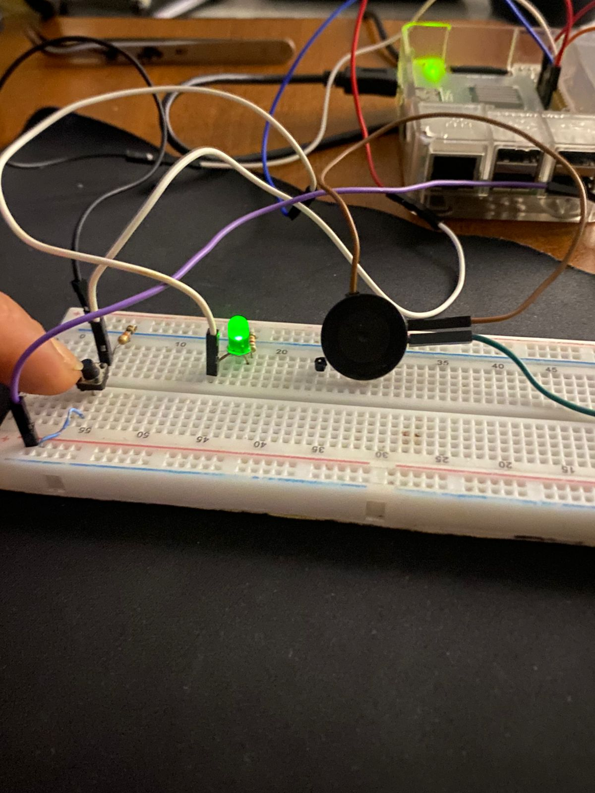
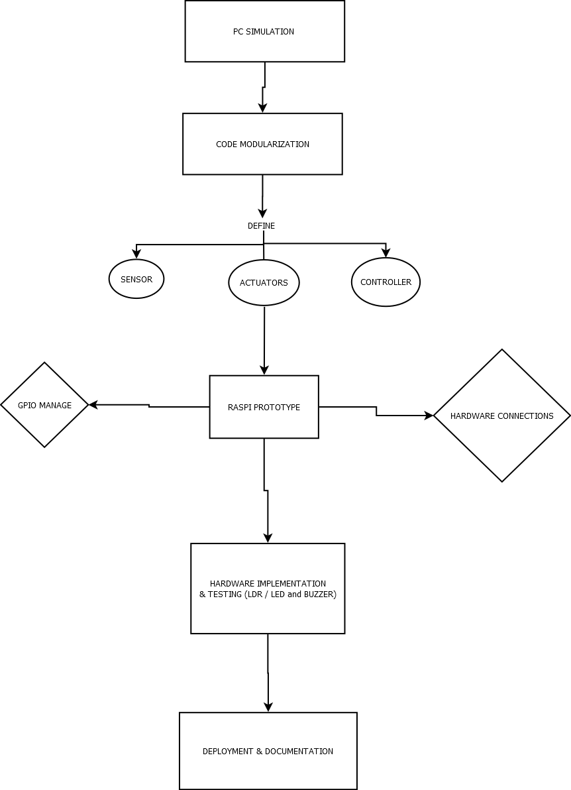
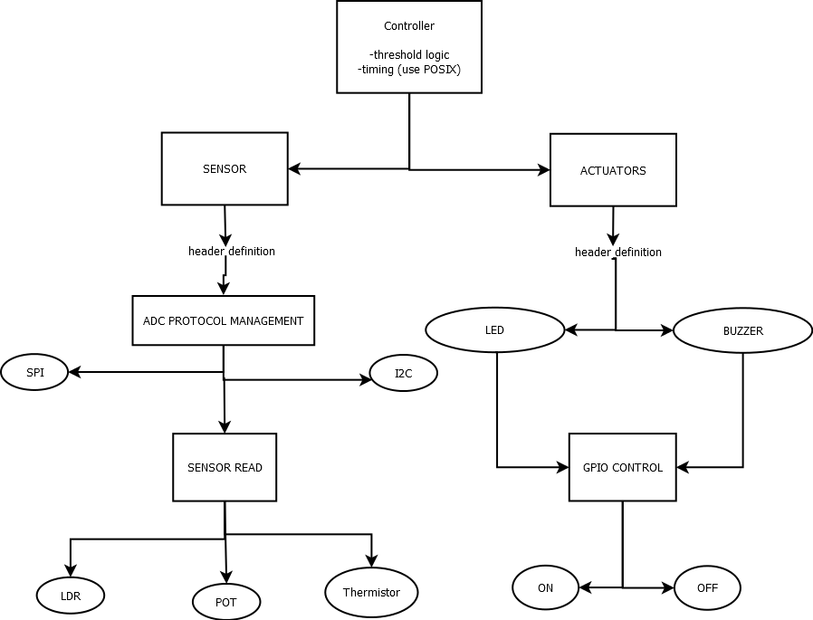

# Embedded Session HW – Closed-Loop Light Controller



This directory contains the complete implementation of a **closed-loop controller** developed for the _Embedded Systems Programming Assignment_.  
The system runs on a **Raspberry Pi 3 Model B** (or WSL simulation) and demonstrates modular C programming, hardware interfacing via **GPIO/SPI**, and reproducible build practices with `gcc` and `Makefile`.

---

## Repository Layout

| Path          | Purpose                                                                                                                                                |
| ------------- | ------------------------------------------------------------------------------------------------------------------------------------------------------ |
| `sensor/`     | Implements `sensor.h` and `sensor.c` — handles data acquisition from an analog source (LDR or potentiometer) through MCP3008 via SPI.                  |
| `actuators/`  | Defines the polymorphic actuator interface `actuator.h`, plus two independent implementations: LED and Buzzer (`led_actuator.c`, `buzzer_actuator.c`). |
| `controller/` | Contains the main loop (`ctl.c`) that integrates all modules. Handles sampling, thresholds, and timing logic using POSIX APIs.                         |
| `tests/`      | Early validation scripts and CSV-based simulation (`sensor_feed.csv`) used before hardware deployment.                                                 |
| `data/`       | Optional sensor datasets or logged runs.                                                                                                               |
| `docs/`       | Documentation, diagrams, and build/deployment notes (`project_workflow.png`, `hw_sw_architecture.png`, `ai_log.md`).                                   |
| `build/`      | Output directory for compiled object files and binaries (ignored by Git).                                                                              |

- **Actuator interface and device control** → [`actuators/`](actuators/)
- **Build outputs and compiled objects** → [`build/`](build/)
- **Main control logic (closed-loop system)** → [`controller/`](controller/)
- **Sensor datasets and test inputs** → [`data/`](data/)
- **Documentation, diagrams, and AI logs** → [`docs/`](docs/)
- **Sensor abstraction and data acquisition** → [`sensor/`](sensor/)
- **Simulation and verification tests** → [`tests/`](tests/)

---

## Project Workflow

1. **Design & Planning**

   - Initial blueprint created from the assignment `Compilation linking interfaces homework.md`.
   - Defined modular structure and interface contracts (`sensor.h`, `actuator.h`).

2. **Sensor Module**

   - Implemented analog sensor acquisition with **MCP3008 (SPI)** and **pigpio** library.
   - Alternative simulation path provided for desktop tests (CSV or random generator).

3. **Actuator Interface**

   - Designed a **polymorphic actuator API** using function pointers: `activate`, `deactivate`, and `status`.
   - Implementations:
     - **LED (GPIO 17)**
     - **Buzzer (GPIO 27)**

4. **Controller**

   - Developed `ctl.c` integrating all modules.
   - Samples sensor every 100 ms, activates/deactivates actuators based on threshold (40%).
   - Uses `clock_gettime(CLOCK_MONOTONIC)` for stable timing and `nanosleep()` for scheduling.

5. **Build Automation**

   - `Makefile` automates builds for both host and Raspberry Pi:
     ```bash
     make           # builds 64-bit target
     ```
   - Manual compilation example:
     ```bash
     gcc -Wall -Wextra -std=c11 \
     controller/ctl.c sensor/sensor.c \
     actuators/led_actuator.c actuators/buzzer_actuator.c \
     -lpigpio -lrt -lpthread -o ctl
     ```

6. **Testing & Deployment**

   - Verified simulation on PC (using CSV input).
   - Deployed on Raspberry Pi with LDR/potentiometer as input sensor.
   - Verified GPIO activation timing and SPI readings.

7. **Documentation & AI Log**
   - All AI interactions and refinements recorded in `docs/ai_log.md`.
   - Diagrams illustrating both the **development workflow** and **hardware/software block architecture** located under `docs/`.

### overflow block diagram



---

## Hardware Setup Overview

| Component                            | Connection                  | BCM Pin      | Notes                      |
| ------------------------------------ | --------------------------- | ------------ | -------------------------- |
| **LED**                              | GPIO → resistor → LED → GND | 17           | Visual indicator           |
| **Buzzer (active)**                  | GPIO → buzzer → GND         | 27           | Audible alarm              |
| **MCP3008**                          | SPI (CE0, MOSI, MISO, SCLK) | 8, 9, 10, 11 | Reads analog input         |
| **LDR / Potentiometer / thermistor** | Analog input → CH0          | —            | Voltage divider to MCP3008 |
| **3.3 V / GND**                      | Power reference             | 1 / 6        | Common rails               |

> SPI must be enabled using `sudo raspi-config → Interface Options → SPI → Enable`.

---

## Architecture Overview

### Software Module Flow

[Controller (ctl.c)]
│
├──> [Sensor Module] → Reads SPI data (light intensity)
│
└──> [Actuator Interface]
├── LED Actuator (GPIO 17)
└── Buzzer Actuator (GPIO 27)

### architecture block diagram



### Hardware–Software Integration

┌──────────────────────┐
│ Controller (Raspberry Pi) │
│ ctl.c logic loop │
└──────────┬───────────┘
│ SPI + GPIO
┌──────────┴───────────┐
│ MCP3008 ADC Chip │
└──────────┬───────────┘
│ analog signal
┌──────────┴───────────┐
│ LDR / Potentiometer │
└──────────────────────┘

---

## References

- [pigpio C Library](https://abyz.me.uk/rpi/pigpio/cif.html)
- [pigpio C Library](https://github.com/joan2937/pigpio#)
- [MCP3008 Datasheet](https://cdn-shop.adafruit.com/datasheets/MCP3008.pdf)
- [POSIX Time APIs](https://man7.org/linux/man-pages/man2/clock_gettime.2.html)

---

## Example Run

```bash
sudo ./ctl

expected output :

Starting closed-loop controller (pigpio hardware version)...
[102.123] Sensor=10.00 → ACTUATORS ON
[103.123] Sensor=10.00 → ACTUATORS ON
[104.123] Sensor=10.00 → ACTUATORS ON
[105.123] Sensor=10.00 → ACTUATORS ON
[106.223] Sensor=90.00 → scheduling OFF
[107.223] Sensor=90.00 → scheduling OFF
...

```
