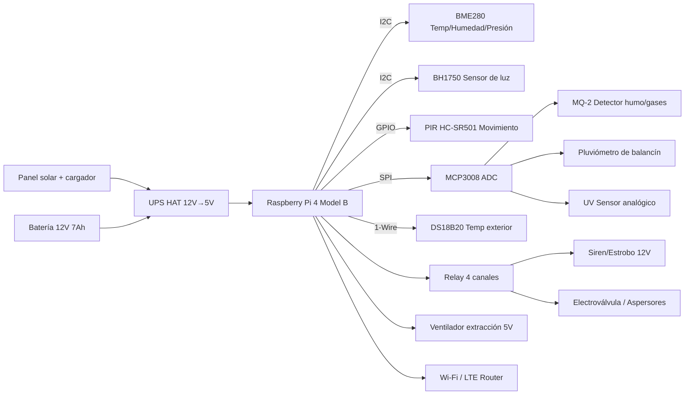

# WeatherShield: Discovery & Design Notebook

## 1. Lifecycle Snapshot & Stakeholder Role

| Fase           | Objetivo clave                                                                               | Evidencia / Artefactos actuales                                                                   | Próxima entrega                                                            |
| -------------- | -------------------------------------------------------------------------------------------- | ------------------------------------------------------------------------------------------------- | -------------------------------------------------------------------------- |
| Descubrimiento | Validar la necesidad de monitoreo ambiental y seguridad perimetral en invernaderos pequeños. | Entrevistas preliminares con dueños de cultivos urbanos y revisión de incidentes de humo/heladas. | Matriz de actores y mapa de procesos del sitio piloto.                     |
| Requerimientos | Traducir necesidades en requisitos medibles (sensores, alertas, autonomía).                  | Lista de requisitos inicial (ver `docs/requirements.md`).                                         | Refinar criterios de aceptación con el stakeholder y priorizar MVP.        |
| Diseño         | Definir arquitectura hardware/software y plan de integración.                                | Diagramas de bloques y estrategia de flujo de datos (sección 1).                                  | Documento de diseño detallado, BOM validada y plan de instalación.         |
| Implementación | Construir prototipo V1 y automatizar despliegues.                                            | Roadmap de sprints (ver `docs/roadmap.md`).                                                       | Prototipo funcional con telemetría básica y bitácora de pruebas unitarias. |
| Pruebas        | Ejecutar pruebas unitarias e integraciones en campo.                                         | Plan de verificación (`docs/verification-plan.md`).                                               | Informe de resultados con evidencia y trazabilidad a requisitos.           |
| Despliegue     | Instalar estación en sitio piloto y documentar aprendizajes.                                 | Checklist de despliegue y guías en progreso.                                                      | Informe final + plan de mejoras y mantenimiento.                           |

**Rol asumido**

> Como coordinador de seguridad agrícola, necesito una estación meteorológica inteligente que detecte humo, variaciones críticas de clima e intrusiones, para proteger al personal, los cultivos y la infraestructura sin depender de rondas manuales.

### Diagrama de hardware (versión preliminar)



### Diagrama de software (versión preliminar)

```mermaid
flowchart TD
    subgraph Edge_Device [Raspberry Pi]
        SRV[weather-node.service]
        MGR[Device Manager]
        SEN[Sensor Drivers]
        ACT[Actuator Controller]
        BUF[Local Data Buffer (SQLite)]
        RULE[Motor de reglas]
        OTA[Actualizador OTA]
    end
    subgraph Cloud [Nube / LAN]
        MQTT[MQTT Broker]
        DB[TimescaleDB / PostgreSQL]
        API[API FastAPI]
        DASH[Dashboard (React + Plotly)]
        ALERT[Notificador (Telegram / Email)]
        CI[Pipeline CI/CD]
    end
    SRV --> MGR
    MGR --> SEN
    SEN --> BUF
    BUF --> MQTT
    MGR --> ACT
    RULE --> ACT
    RULE --> ALERT
    MQTT --> DB
    DB --> API
    API --> DASH
    CI --> OTA
    ALERT -->|Ack| MGR
```

## 2. Self-Stakeholder Reflection

- **Qué problema enfrento:** El invernadero piloto no cuenta con monitoreo continuo ni alarmas tempranas frente a incendios, heladas o intrusiones; depende de personal que solo puede revisar de forma manual cada pocas horas.
- **Cómo sucede:** Se utilizan sensores portátiles y planillas en papel; cuando aparece humo o una helada nocturna, no hay aviso inmediato y los cultivos se dañan antes de reaccionar.
- **Qué sería éxito:** Recibir alertas en el móvil cuando cualquier variable supere umbrales, tener un histórico confiable para decidir riegos y ventilación, y activar aspersores/sirena en menos de 30 segundos sin intervención humana.
- **Qué me preocupa:** Integrar sensores analógicos (MQ-2, pluviómetro) con la Raspberry Pi, garantizar energía estable durante cortes prolongados y mantener la seguridad de la red en solo dos meses.

## 3. Problem Statement Canvas

| Elemento             | Descripción                                                                                                                 |
| -------------------- | --------------------------------------------------------------------------------------------------------------------------- |
| Usuario persona      | Valentina, coordinadora de seguridad y mantenimiento en un invernadero periurbano.                                          |
| Necesidad primaria   | Vigilar microclima, humo e intrusiones sin presencia permanente.                                                            |
| Contexto             | Invernadero de 200 m² con Wi-Fi local, acceso 4G intermitente y presencia de personal en turnos.                            |
| Dolor actual         | Alertas tardías, sin datos históricos, sensores manuales que exigen entrar en áreas potencialmente peligrosas.              |
| Solución temporal    | Visitas horarias con medidores portátiles y registros manuales.                                                             |
| Propuesta de valor   | Estación modular desplegable en exteriores que integra monitoreo ambiental, seguridad activa y automatización de respuesta. |
| Diferenciadores      | Integración de sensores de humo y movimiento en un dashboard único, redundancia energética y escalabilidad modular.         |
| Resultados esperados | Alertas en tiempo real, reducción de pérdidas por clima, evidencia para auditorías de seguridad y cumplimiento.             |
| Métricas de éxito    | Tiempo de detección < 30 s, uptime > 95 %, cobertura de variables críticas y cero falsos negativos en pruebas controladas.  |

## 4. Beginner Risk Lab

| Riesgo                                                             | Prob. (1-3) | Impacto (1-3) | Mitigación                                                                                              | Contingencia                                                          |
| ------------------------------------------------------------------ | ----------- | ------------- | ------------------------------------------------------------------------------------------------------- | --------------------------------------------------------------------- |
| Tensión inestable o corte prolongado                               | 2           | 3             | Implementar UPS HAT y monitoreo de voltaje, pruebas de autonomía con carga completa.                    | Modo ahorro (muestreo cada 5 min) y alerta de energía crítica.        |
| Lecturas inconsistentes del MQ-2 por temperatura/humedad           | 3           | 2             | Calibrar semanalmente, aislar sensor en carcasa ventilada, correlacionar con BME280.                    | Descartar lectura y enviar alerta de mantenimiento si deriva > 20 %.  |
| Sobrecalentamiento de Raspberry Pi en caseta                       | 2           | 2             | Aislante + ventilador controlado por PWM y umbral de temperatura interna.                               | Throttling forzado y notificación de temperatura crítica.             |
| Pérdida de conectividad Wi-Fi o LTE                                | 3           | 2             | Store-and-forward en buffer local (SQLite) y reintentos exponenciales.                                  | Exportación manual vía USB cada 24 h y sincronización diferida.       |
| Intrusión física al gabinete                                       | 1           | 3             | Sensor reed + bloqueo mecánico, registro de eventos y sellos inviolables.                               | Alarma sonora con batería propia y aviso de sabotaje.                 |
| Retraso en desarrollo software por curva de aprendizaje en drivers | 2           | 3             | Dividir tareas en módulos, usar librerías probadas (gpiozero, paho-mqtt), sesiones de pair programming. | Ajustar alcance: priorizar telemetría, posponer actuadores avanzados. |
| Condensación o humedad en gabinete                                 | 2           | 2             | Uso de desecantes, respiraderos con malla y recubrimiento conformal en PCB.                             | Paro controlado, secado y sustitución de sensores dañados.            |

## 5. Requirement Validation Gallery Walk

1. El sistema debe medir temperatura, humedad relativa, presión barométrica y luminosidad cada 60 segundos, con precisión de ±2 % HR y ±1 °C.
2. El sistema debe detectar presencia de humo/gases combustibles (MQ-2) y movimiento (PIR) y generar una alerta sonora y digital en < 30 s.
3. El dispositivo debe almacenar localmente al menos 48 horas de datos y sincronizarlos con el backend vía MQTT cuando haya conectividad.
4. El sistema debe accionar automáticamente aspersores o sirena al superar umbrales configurables y permitir anulación manual desde el dashboard.
5. El prototipo debe operar con energía autónoma al menos 12 horas mediante batería/UPS y reportar nivel de carga cada 10 minutos.

## 6. Wrap-up & Action Items

- Se definió un alcance realista de dos meses que integra monitoreo ambiental y seguridad activa con Raspberry Pi 4 y sensores disponibles.
- Los riesgos críticos (energía, sensores analógicos, conectividad, humedad) ya cuentan con mitigaciones iniciales y contingencias.
- Se estableció una lista mínima de requisitos medibles vinculada al plan de verificación y al roadmap.

**Acciones inmediatas (Semana 1-2):**

- Formalizar entrevistas con el stakeholder y validar métricas de éxito.
- Completar BOM en `hardware/bom.md` y confirmar disponibilidad de módulos y cableado.
- Crear prototipo de lectura de sensores digitales (BME280, BH1750, DS18B20) y registrar datos en buffer local.
- Configurar repositorio de código y pipeline CI básico para linting/tests en Raspberry Pi OS.

**Acciones a corto plazo (Semana 3-4):**

- Integrar sensores analógicos vía MCP3008 y calibrar el MQ-2.
- Implementar publicación MQTT y dashboard mínimo viable.
- Definir pruebas unitarias automatizadas por módulo y registrar evidencia en `docs/verification-plan.md`.

**Acciones a mediano plazo (Semana 5-8):**

- Ejecutar pruebas de estrés energética y de clima con cámara de humedad/temperatura.
- Desplegar prototipo en sitio piloto, recoger feedback y ajustar reglas de alertas.
- Preparar demo final, video de funcionamiento y reporte de lecciones aprendidas.
